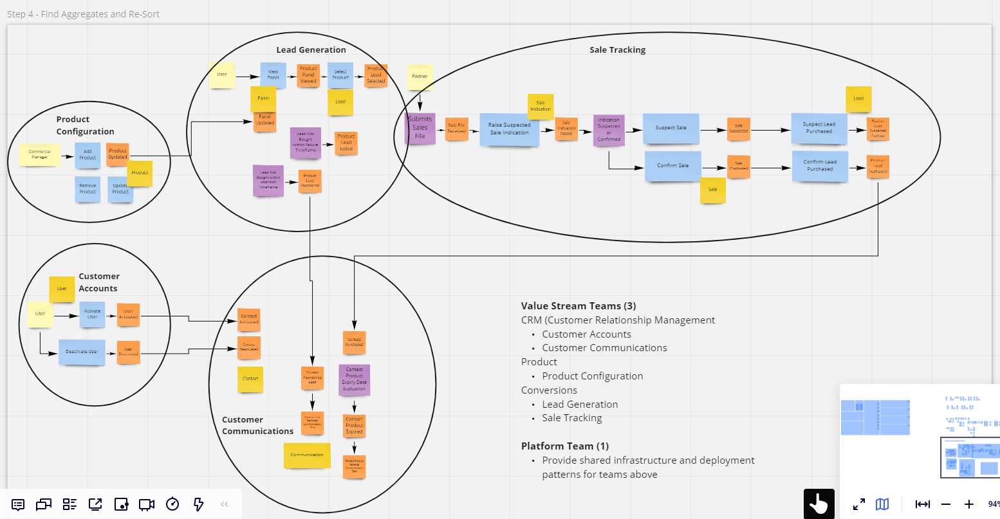
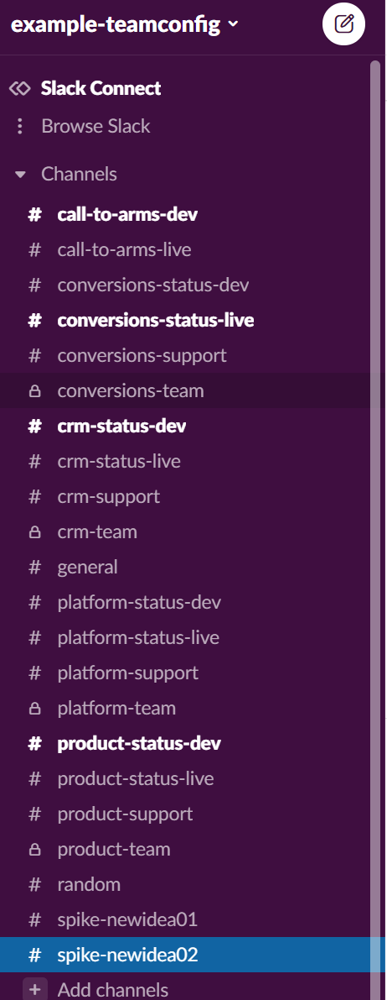

- [Description](#description)
- [Why do this?](#why-do-this)
- [Example Team Implementation](#example-team-implementation)
- [Example Communication Strategy](#example-communication-strategy)
- [Dependencies](#dependencies)
- [Guide](#guide)
  - [How to Validate Teams Schema](#how-to-validate-teams-schema)
  - [How to Generate Documentation](#how-to-generate-documentation)
  - [How to Add Teams](#how-to-add-teams)
  - [How to Amend Teams](#how-to-amend-teams)
  - [How to Amend Schema](#how-to-amend-schema)
  - [How to Style Documentation](#how-to-style-documentation)

## Description

This product aims to programmatically create a Teams API for an entire organisation based on the [Team API](https://github.com/TeamTopologies/Team-API-template) put forward by [team topologies](https://teamtopologies.com/) and starting to take into consideration the required layer of abstraction across a multi-vendor ecosystem of tooling as discussed in [project to product](https://projecttoproduct.org/).
From this information and a schema the goal is to validate the team setup based on business rules and also create automatic documentation.
The schema for the teams can be found in [team.schema.json](/teams/schema/team.schema.json) and an example implementation of a team in [conversions_team.json](/teams/conversions_team.json).
The example documentation this codebase produces can be found as raw html in [docs/index.html](docs/index.html), or to see it rendered as it currently is as a webpage in the repo go [here](https://htmlpreview.github.io/?https://raw.githubusercontent.com/griff182uk/teamconfig/master/docs/index.html). This index page is now a pointer to each individual page, a [search method](https://github.com/griff182uk/teamconfig/issues/3) is on the current issues list along with making the solution easier on the eye.

## Why do this?

- **Abstraction for a Consistent Viewpoint** - In the modern technical ecosystem there are a huge number of tools and vendors. Whether your organisation is going through a slow transition phase from one set of tooling to another, or whether different parts of your organisation use different toolsets permanently, configuration of consistent models of communication, knowledge bases, workloads and team makeup can provide a consistent viewpoint over time despite the upheaval underneath. By keeping the layer of abstraction thin, as per the [schema](/teams/schema/team.schema.json) proposed, then the detail can be held locally and managed by the separate teams. All the local teams have to do is ensure that their schema is maintained and they adhere to the minimal strategic rules proposed centrally (e.g. the [example communication strategy](#example-communication-strategy)).
- **Programatically Represent your Organisation** - The [team schema](/teams/schema/team.schema.json) can provide the right properties and enums you require for centralising terminology required across your ecosystem that is agnostic to any implementation. It purely represents your organisation and can be called upon when needed. For example a Powershell module (see [open issue](https://github.com/griff182uk/teamconfig/issues/9)) could be added that utilises the schema and ensures only the correct tags are applied to resources either from team name property enums or potentially "cost centre" if this were added to the schema, or anything else relevant. Therefore as an example, regardless of whether your organisation was using AWS, Azure or Google as a cloud vendor, it could still reference the one consistent representation of your organisation via the teamconfig to validate and provide consistency.
- **Single Point of Responsibility** - A number of organisations document their services and responsibilities in documents that proliferate and that cannot be referenced in code, this makes it difficult to programatically link a team with the code they are maintaining. This leads to difficulty in identifying responsibility lines (e.g. difficulty in tagging consistently as mentioned in point 2) or simply duplication and mistrust as no single source of truth has been committed to.
- **Programatically Generate and Validate your Organisation** - As well as simply representing your organisation, all of the [team schemas](/teams/schema) together can represent how you want the communication, knowledge base and work management tooling to look like. Using common API tooling for products like slack, the organisation configuraiton informaiton could just auto generate all of the appropriate channels for teams to function, and validate them periodically with notifications of organisational settings have drifted too far from optimimum. The same could be applied to backlog and knowledge base management. As well as ongoing visibility and control of the basics of your organisation, it could also assist in communication tooling migration, by essentially deploying it from source to the tools required.

## Example Team Implementation

The [example team implementation](https://htmlpreview.github.io/?https://raw.githubusercontent.com/griff182uk/teamconfig/master/docs/index.html) in this codebase was extracted by performing a simulated event storming exercise on a fictional company that simply:

- Activates Accounts
- Configures Products
- Generates Leads
- Evaluates Offline Purchases
- Contacts Customers

The outcome of this event storming exercise was carried out in [Miro](https://miro.com) with the basic outcome shown below. 



This was generated from this [Miro Event Storming](https://miro.com/miroverse/event-storming/) template. The teams determined were more arbitrary than by insight as the organisation does not exist, but they resulted in:

- [Product Team](https://htmlpreview.github.io/?https://raw.githubusercontent.com/griff182uk/teamconfig/master/docs/product_team.html)
- [Conversions Team](https://htmlpreview.github.io/?https://raw.githubusercontent.com/griff182uk/teamconfig/master/docs/conversions_team.html)
- [CRM Team](https://htmlpreview.github.io/?https://raw.githubusercontent.com/griff182uk/teamconfig/master/docs/crm_team.html)
- [Platform Team](https://htmlpreview.github.io/?https://raw.githubusercontent.com/griff182uk/teamconfig/master/docs/platform_team.html)

This is purely fictional for an example implementation and anything like this should be given great thought, care and collaboration within your organisation. The actual teams and bounded context you setup would require much further thought and design. For further information on event storming please see [here](https://www.eventstorming.com/) or on domain driven design see [here](https://martinfowler.com/bliki/DomainDrivenDesign.html). Once you have the outcomes from these though the principal of the team API setup proposed in this codebase should still hold true.

## Example Communication Strategy

The schema proposes a fairly standard communication strategy setup which is consistent throughout. It aims to prevent proliferation and confusing communication structures being implemented when a business is well known. It also aims to reduce on-call or intra-team noise by dedicating channels to specific purposes and environments. Below is an example implementation that you may want to adjust for your organisation, the point is that you should establish some form of communication strategy which will help your organisation whilst also helping consistency in the team schema.

Applies to both e-mail and messenger medium (e.g. slack, teams)

- **{teamname}-team**: For e-mail this would be for regular communications and notifications this team requires that they do not need to respond to. In your messenger tool of choice this channel would be restricted to only the team members and the only channel to actually be private. The goal here is not to hide the communications but reduce noise for intra-team communications and allow for scrum communications etc.
- **{teamname}-support**: For e-mail this would be for requesting support by customers for the products and services the team maintains with the team expected to respond. In your messenger tool of choice this channel would be open to all.

Applies to only messenger medium (e.g. slack, teams)

- **{teamname}-dev**: In the messenger channel this would be for development environment deploy notifications, development environment alerts and also for anyone to manually raise issues in the test environments for this team. This could also be where pull request notifications for the team are posted, being a channel the team would be subscribed to whilst still being open to all if expertise was required from elsewhere. This channel would essentially represent notificaiton steps for the SDLC to reach production and the notifications would represent each step to remove WIP from the system.
- **{teamname}-live**: In the messenger channel this would be for live environment deploy notifications, live environment alerts and also for anyone to manually raise issues in the live environments for this team. **This would be a channel that oncall would be integrated with.**

While the aspiration is to be able to localise the noise created by deployments and alerting, there will be instances during emergencies where the issue may be difficult to localise and diagnose requiring everyone who can help, to help. In these cases the following two channels can be used:

- **call-to-arms-live** - The channel for live issues requiring everyones attention to resolve. **This would be a channel that oncall would be integrated with.**
- **call-to-arms-dev** - The channel for development issues requiring everyones attention to resolve.

There will be times when a new idea or team is proposed but it may never become a fully fledged team, or has too little information at that point to become part of your team configuration. For these, "spike" channels can be created until they are regarded as successful and become true components of your organisation where they will be added to your configuration. These should be monitored and committed or removed as soon as their acceptance or faiure is established.

- **spike-{proposal}** - The channel for all aspects of the new proposal.

An example implementation in slack of what this would look like can be seen below:


## Dependencies

- Pyton Installation
- [json2table](https://pypi.org/project/json2table/)
- [jsonschema](https://pypi.org/project/jsonschema/)
- requests
- networkx

```bash
pip install json2table
pip install jsonschema
pip install requests
pip install neworkx
pip install matplotlib
pip install scipy
pip install pyvis

pip list
```

## Guide

To perform any of the actions below using the python code in this repo:

- Clone the repo to your machine.
- Activate the virtual python environment.

```bash
venv\scripts\activate
```

### How to Validate Teams Schema

- Within your virtual python environment, open a terminal and run [app/validate.py](app/validate.py). This should produce no errors and evebtually return the message "Schema validation passed".

```
(venv) D:\repos\teamconfig>app\validate.py      
Schema validation passed.
```

If there are any legitimate schema errors please fix your team implementation. If you need to add missing enums that are now part of your organisation please go to ["How to Amend Schema"](#how-to-amend-schema).

### How to Generate Documentation

- Within your virtual python environment, open a terminal and run [app/generate_docs.py](app/generate_docs.py). This will replace the html found in [docs](/docs) with the current teams configuration. It should produce no errors and return the message "Docs created in docs/docs/{team}_team.html and finally "Docs created in docs/index.html".

```
(venv) D:\repos\teamconfig>app\generate_docs.py 
Docs created in docs/conversions_team.html
Docs created in docs/crm_team.html
Docs created in docs/platform_team.html
Docs created in docs/product_team.html
Docs created in docs/index.html
Docs created in docs/teamgraph.png
```

To preview this on github itself you can use this [example](https://htmlpreview.github.io/?https://raw.githubusercontent.com/griff182uk/teamconfig/master/docs/index.html) to see it in the current repo, or go to [htmlpreview](https://htmlpreview.github.io/) for github.io and enter the URL of your own.

### How to Add Teams

To add a team you need to add information to a new team to in the teams folder. You can copy an [example](/teams/conversions_team.json) of a team already present as a good starting point, that meets the [schema](/teams/schema/team.schema.json) provided, rename the file and start amending the schema.
Once you have added a team you should [validate](#how-to-validate-teams-schema) the teams against the schema again to ensure no rules have been broken. If there are any legitimate schema errors please fix your team implementation. If you need to add missing enums that are now part of your organisation please go to ["How to Amend Schema"](#how-to-amend-schema).

### How to Amend Teams

To amend a team implementation simply open the relevant file in the teams folder, then edit the properties you require ensuring that you adhere to the [schema](/teams/schema/team.schema.json). When complete again perform [validation](#how-to-validate-teams-schema). If you need to add missing enums that are now part of your organisation please go to ["How to Amend Schema"](#how-to-amend-schema).
### How to Amend Schema

You may need to amend the [schema](/teams/schema/team.schema.json) to meet local needs, particularly the values available in the lookups for different properties.
For example you may get a a validation failure as follows:

```
Unexpected 'Product Configuration Portal' is not one of ['Event Broker', 'Schema Registry', 'Product Panel', 'Sale Tracking', 'Product Renewal Reminders', 'Abandoned Lead Notifications']
Failed validating 'enum' in schema['properties']['products']['items']['properties']['name']:
    {'description': 'Name of the product provided',
     'enum': ['Event Broker',
              'Schema Registry',
              'Product Panel',
              'Sale Tracking',
              'Product Renewal Reminders',
              'Abandoned Lead Notifications'],
     'type': 'string'}
```

Which will mean you will need to add the appropriate product to the list in the [schema](/teams/schema/team.schema.json) as below.

```json
       "properties": {
                "name": {
                    "type": "string",
                    "description": "Name of the product provided",
                    "enum": [
                        "Event Broker",
                        "Schema Registry",
                        "Product Panel",
                        "Sale Tracking",
                        "Product Renewal Reminders",
                        "Abandoned Lead Notifications",
                        "Product Configuration Portal"
                    ]
                },
```

You can take this approach to any of the enums you may need to add to the schema or any other schema amendments you may need to apply.

### How to Style Documentation

If you want to amend the style of the documentation, edit the [docs/styles/style.css](docs/styles/style.css) file with the CSS styling you require.

test
